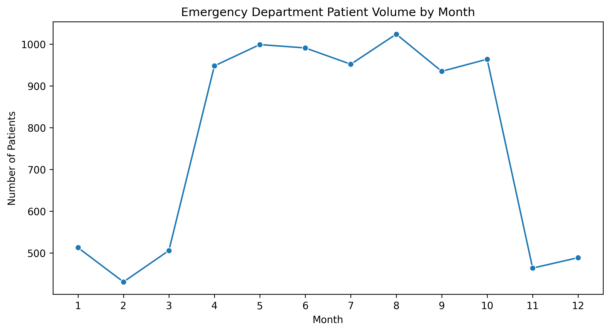
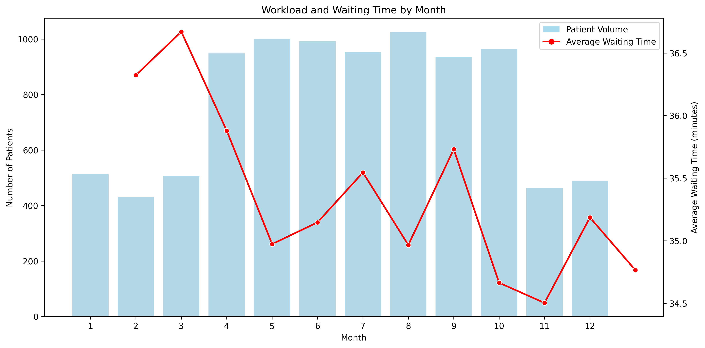
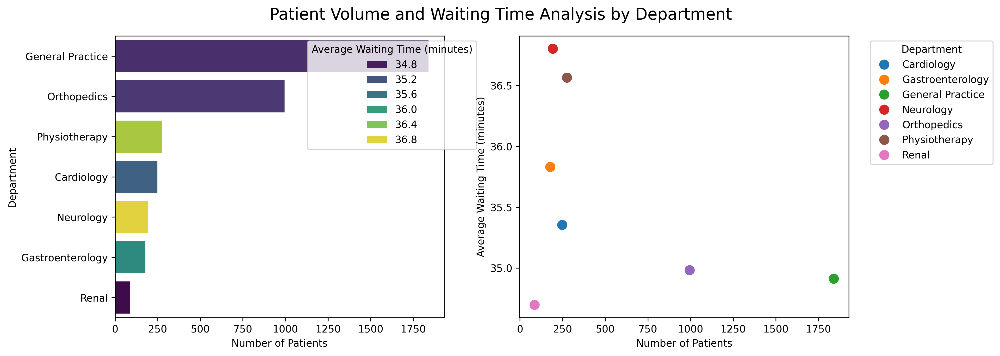
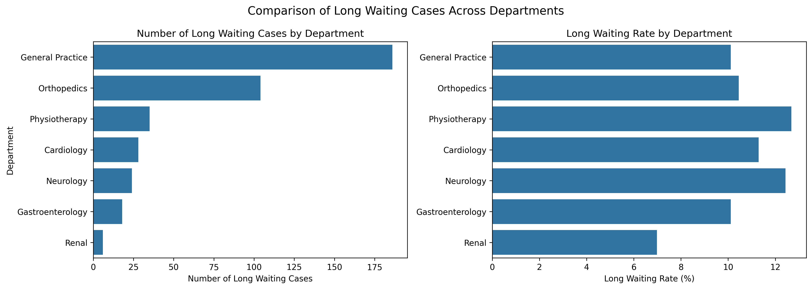

# Hospital Emergency Department Operations Analysis


---

## Project Overview

This project analyzes Emergency Department (ED) operations using patient flow data to evaluate patient demand, waiting time, department workload, and admission patterns.

Using SQL and Python, the project uncovers operational trends and provides data-driven insights to support healthcare resource planning and operational decision-making.

---

## Business Problem

Emergency Departments often face operational challenges such as:

- Long patient waiting times
- Low patient satisfaction
- Inefficient resource allocation
- Difficulty identifying operational bottlenecks

---

## Business Objectives

This project aims to:

- Analyze Emergency Department operations
- Identify workload and waiting time patterns
- Evaluate department performance
- Support operational improvement through data-driven insights

---

## Dataset

**Source:** Healthcare Analytics Patient Flow Dataset (Kaggle)

**Dataset Summary**

- **Records:** 9,216 Emergency Department visits
- **Period:** September 2023 – December 2024

---

## Tools

- SQL (BigQuery)
- Python (Pandas, NumPy, Matplotlib, Seaborn)
- Jupyter Notebook
- GitHub

---

## Methodology

1. Data Collection
2. Data Cleaning and Preparation
3. Exploratory Data Analysis
4. Operational Analysis
5. Business Insights
6. Business Recommendations

---

## Key Visualizations

### Emergency Department Patient Volume by Month

<p align="center">
  
</p>

**Key Insight**

Patient demand increased substantially from **April to October**, with **August** recording the highest patient volume. This indicates a clear seasonal workload pattern in the Emergency Department.

---

### Workload and Waiting Time by Month

<p align="center">
  
</p>

**Key Insight**

Despite increased patient volume during peak months, average waiting time remained relatively stable. This suggests that seasonal demand alone was not the primary driver of prolonged waiting times.

---

### Department Workload Analysis

<p align="center">
  
</p>

**Key Insight**

General Practice and Orthopedics handled the highest patient volumes, while Neurology experienced relatively longer average waiting times despite serving fewer patients.

---

### Long Waiting Time Analysis

<p align="center">
  
</p>

**Key Insight**

Departments with more long waiting cases generally also handled more patients. No department demonstrated an exceptionally high long waiting rate compared with others.

---

## Key Findings

- Emergency Department demand shows a clear seasonal pattern from April to October.
- Patient volume remains relatively stable throughout the day without distinct congestion periods.
- General Practice and Orthopedics receive the highest patient volume.
- Neurology experiences relatively longer waiting times despite lower workload.
- No strong relationship is observed between department workload and average waiting time.
- Longer waiting times are likely influenced by operational factors beyond patient volume.

---

## Business Recommendations

- Adjust staffing based on seasonal patient demand.
- Closely monitor high-volume departments.
- Review departments with relatively longer waiting times.
- Collect additional operational data, such as patient acuity, staffing levels, queue length, and treatment duration, to better understand waiting time drivers.

---

## Repository Structure

```text
hospital-ed-operations-analysis/
│
├── Dataset/
│   ├── README.md
│   └── hospital_operation_clean.csv
│
├── SQL/
│   ├── 01_data_preparation.sql
│   ├── 02_kpi_analysis.sql
│   ├── 03_operational_analysis.sql
│   └── 04_department_analysis.sql
│
├── Python/
│   └── hospital_emergency_department_analysis.ipynb
│
├── images/
│   ├── patient_volume_by_month.png
│   ├── workload_waittime_by_month.png
│   ├── patient_volume_vs_waittime_by_dep.png
│   └── comparison_long_wait_by_dep.png
│
├── LICENSE
├── .gitignore
└── README.md
```

---

## Author

**Truong Do Vinh Nghi**

Aspiring Data Analyst

📌 GitHub: https://github.com/nghitrg

📌 LinkedIn: *(Coming Soon)*
